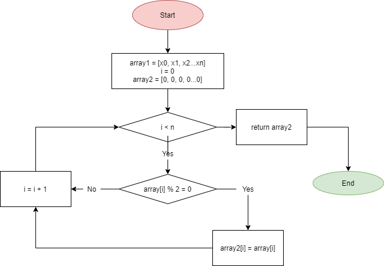

## Задача: Написать программу, которая из имеющегося массива целых чисел формирует массив из четных чисел.

1. Создание метода `GetArray` c аргументами (количество элементов, минимальное значение, максимальное значение)
* int метод возврвщвет массив, заполненный случайными числами из диапазона minValue - maxValue

2. Создание метода `PrintArray` с аргументом (целочисленный массив)
* void метод берет заданный массив и выводит его на экран

3. Создание целочисленного массива `int [] defoltArray` с помощью метода `Getarray` с указанием вручную длины, минимального и максимального значений

4. Печать массива `defoltArray` с помощью метода `PrintArray`

5. Создание метода `GetCountEven` с аргументом (целочисленный массив)
* метод считает количество четных элементов в заданном массиве и возвращает число

6. Создание переменной `N` для использования метода `GetCountEven`, в которой будет храниться количество четных элементов массива (размер будущего массива)

7. Создание метода `GetArrayEvenNumbers` c аргументами (целочисленный массив, размер)
* int метод создает целочисленный массив на основе первого из четных элементов с заданным размером `size`
работа метода описана в блок-схеме 

8. Создание целочисленного массива `int[] evenArray` с помощью метода `GetArrayEvenNumbers` со ссылкой на целочисленный массив `defoltArray` и количество элементов `N`

9. Печать массива `evenArray` с помощью метода `PrintArray`

